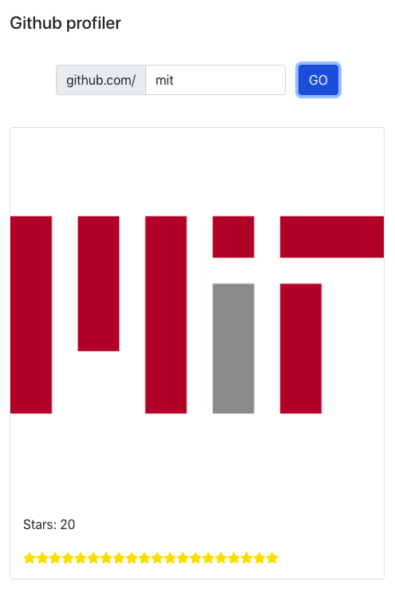

# GIT PROFILER

# Restfully query a user to get their profile picture, number of star gazers, and summarize the contents of their repos.
#### Star gazers is defined as the aggregate number of stars a user has received on each of their repos.

 

#### This project was built with React 18.2 using the latest functional components and hooks functionality.  
* React Class Components are becoming obsolete which is why this was done in functional components with hooks. 
* I could have used Redux to manage states but that's too much overhead for a lightweight app.
#### READ.ME repo files are found, fetched, then analyzed with GPT3 AI
#### The API server runs on express using a cloud MongoDB server for caching git users.
* Access instructions to the MongoDB server are in the .env file.
#### The styling was done with Bootstrap 5.

 

### TO DO: ###
* Handle token authorization for express server requests
* Configure AWS Load balancer with SSL certificate for HTTPS access

Deployed to AWS at <s>http://3.145.22.53:3000/</s>
Run without hangup setsid nohup npm run start & and update proxy/server variable to ec2 ip

 

## Available Scripts

### `npm i`

Install the latest modules in the project and /server directory.

### `npm start`

Run this in the project directory and also in the /server directory for caching and API calls:

Open [http://localhost:3000](http://localhost:3000) to view the app in your browser.

You may also see any transaction logs in the console when you query usernames.

The API server is configured to run on port 8081.  Remember to run npm start in the /server directory.

### `npm test`

Launches the test runner in the interactive watch mode.

### `npm run build`

Builds the app for production to the `build` folder.

It correctly bundles React in production mode and optimizes the build for the best performance.

The build is minified and the filenames include the hashes.

 

